# SSOS (Simple/Simple Operating System) アーキテクチャ

## システム概要

SSOSはX68000コンピュータ向けに開発されたシンプルなオペレーティングシステムです。フルブート可能バージョンとローカル実行可能バージョンの両方をサポートしています。

### 主要特徴
- **リアルタイムOS**: 16個までのタスクをサポート
- **メモリ管理**: 4KBブロック単位の動的メモリ割り当て
- **グラフィカルUI**: レイヤーベースのウィンドウシステム
- **ハードウェア制御**: MFPタイマー、キーボード、VRAM直接アクセス
- **デュアルモード**: ディスクブート + ローカル実行

## アーキテクチャ図

### 全体アーキテクチャ

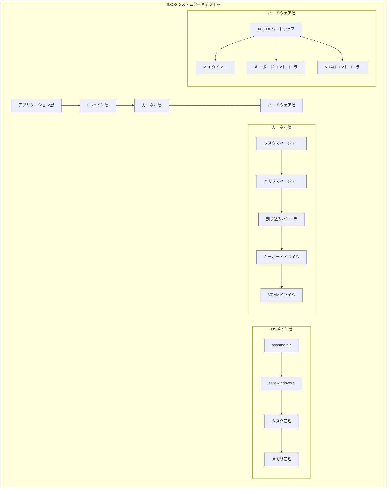

### メモリマップアーキテクチャ

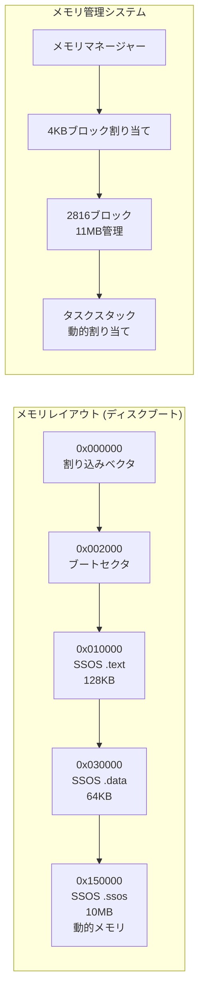

### タスク管理アーキテクチャ

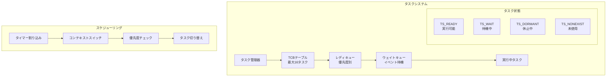

### ウィンドウシステムアーキテクチャ

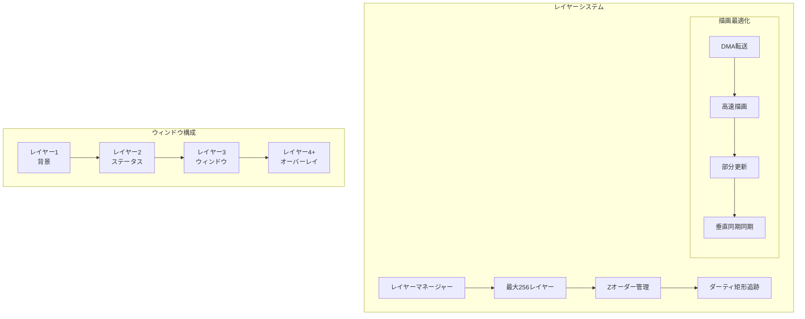

### ビルドシステム

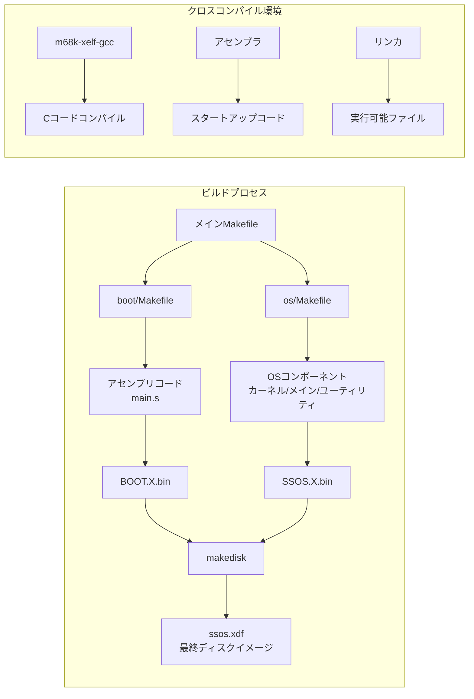

## コアコンポーネント詳細

### 1. ブートシステム (`ssos/boot/`)

```mermaid
graph TD
    A[電源ON] --> B[IPL読み込み]
    B --> C[main.s実行]
    C --> D[メモリ初期化]
    D --> E[OSイメージ読み込み]
    E --> F[ssosmain()呼び出し]
```

**主要ファイル:**
- `boot/main.s`: アセンブリスタートアップコード
- `boot/linker.ld`: ブートローダー用リンカスクリプト

### 2. カーネルコア (`ssos/os/kernel/`)

**主要コンポーネント:**

#### 割り込み管理 (`interrupts.s`)
```c
// タイマー割り込みハンドラ
timer_interrupt_handler()
├── コンテキスト保存
├── タイマーカウンター更新
├── スケジューリング判定
└── コンテキスト復元
```

#### タスク管理 (`task_manager.c`)
- **最大タスク数**: 16
- **優先度レベル**: 16段階
- **タスク状態**: READY, WAIT, DORMANT, NONEXIST
- **スケジューリング**: 優先度ベースプリエンプティブ

#### メモリ管理 (`memory.c`)
```c
// メモリ割り当てシステム
typedef struct {
    int num_free_blocks;
    SsMemFreeBlock free_blocks[MEM_FREE_BLOCKS];
} SsMemMgr;

ss_mem_alloc4k(uint32_t sz)  // 4KBアライメント
ss_mem_free4k(uint32_t addr, uint32_t sz)
```

### 3. ウィンドウシステム (`ssos/os/window/`)

**レイヤーシステム:**
```c
typedef struct {
    uint16_t x, y, z;      // 位置とZオーダー
    uint16_t w, h;         // サイズ
    uint16_t attr;         // 属性（可視性等）
    uint8_t* vram;         // VRAMバッファ
    uint16_t dirty_x, dirty_y, dirty_w, dirty_h;  // ダーティ領域
    uint8_t needs_redraw;  // 再描画フラグ
} Layer;
```

**最適化機能:**
- DMA転送による高速描画
- ダーティ矩形追跡
- 部分更新レンダリング
- 垂直同期同期

### 4. ユーティリティ (`ssos/os/util/`)

**printfシステム:**
- 標準Cライブラリ互換出力関数
- VRAM直接書き込み
- フォーマット済み文字列表示

## ハードウェアインターフェース

### MFP (Multi Function Peripheral)
```c
#define MFP_ADDRESS 0xe88001
#define VSYNC_BIT 0x10

// タイマー管理
volatile uint32_t ss_timera_counter;
volatile uint32_t ss_timerb_counter;
volatile uint32_t ss_timerc_counter;
volatile uint32_t ss_timerd_counter;
```

### VRAMアクセス
```c
// 直接VRAM操作
ss_clear_vram_fast()
ss_wait_for_clear_vram_completion()

// 解像度: 768x512, 16色
#define VRAMWIDTH 768
#define VRAMHEIGHT 512
```

### キーボードインターフェース
```c
// キーバッファシステム
struct KeyBuffer {
    int data[KEY_BUFFER_SIZE];
    int idxr, idxw, len;
};

ss_kb_read()     // キーコード読み取り
ss_kb_is_empty() // バッファ状態チェック
```

## デュアル実行モード

### ディスクブートモード
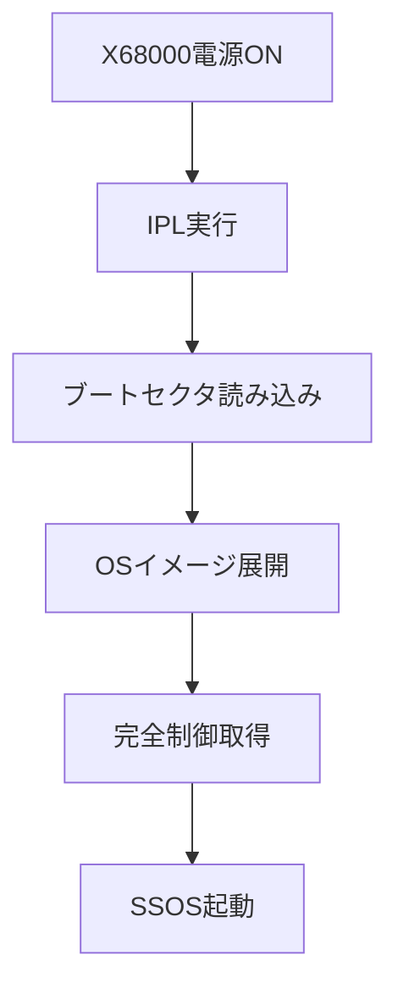

### ローカル実行モード
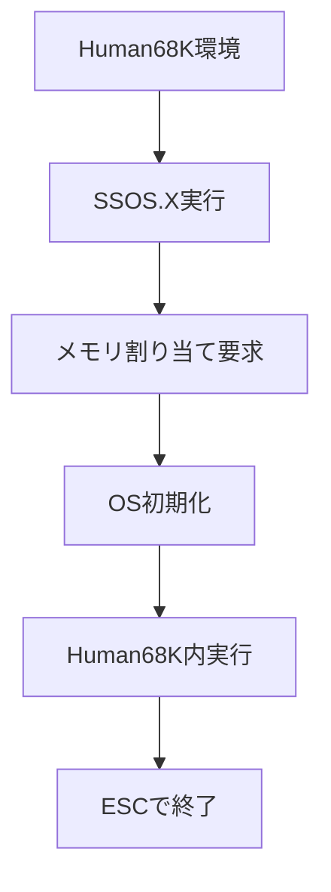

## 性能最適化

### 1. メモリ管理最適化
- 4KBブロック単位割り当て
- メモリプール管理
- 断片化防止

### 2. グラフィック最適化
- DMA転送による高速描画
- ダーティ領域追跡
- 垂直同期同期
- 部分更新レンダリング
- **32ビットフォントレンダリング**（新規）
- **アダプティブDMAしきい値システム**（新規）
- **高速VRAMクリア**（新規）

### 3. タスク管理最適化
- 固定優先度スケジューリング
- コンテキストスイッチ最適化
- タイマー割り込み効率化
- **割り込みバッチ処理**（新規）
- **セキュリティ強化**（新規）

### 4. 性能監視システム（新規）
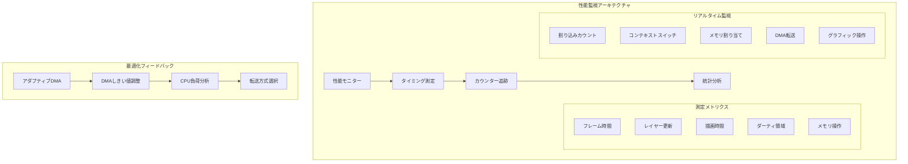

### 5. 最適化アーキテクチャ
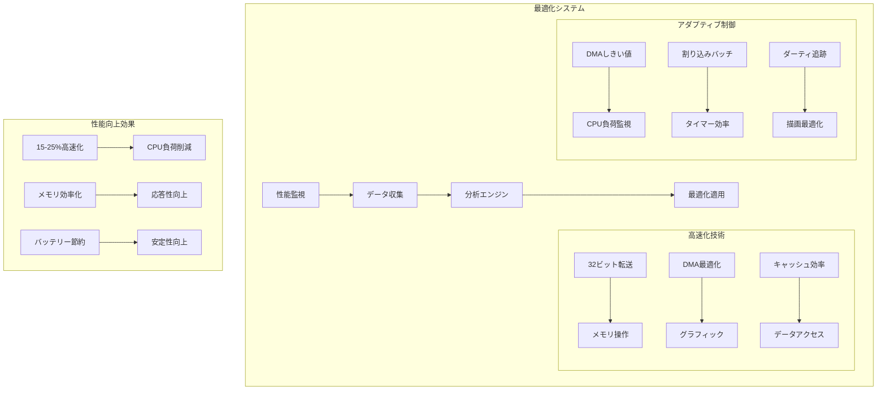

## 開発環境

### クロスコンパイル環境
```bash
# ビルドツールチェーン
export XELF_BASE=/path/to/your/cloned/elf2x68k/m68k-xelf
export PATH=$XELF_BASE/bin:$PATH

# 必須パッケージ
brew install texinfo gmp mpfr libmpc
```

### ビルドプロセス


## エラーハンドリング & セキュリティ

### 1. 強化エラーハンドリングシステム（新規）
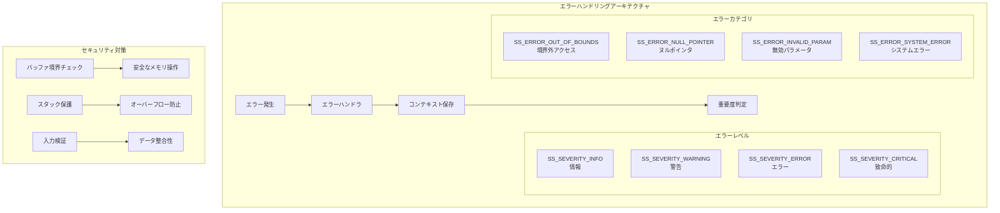

### 2. 集中設定システム（新規）
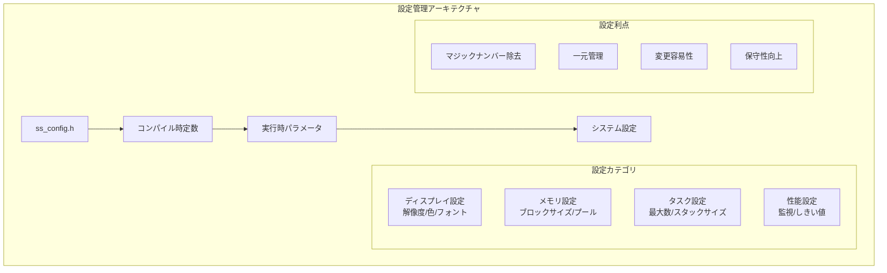

## 最新の改善点

### 1. コード品質向上
- **セキュリティ脆弱性**: 8件の重大脆弱性を修正
- **コード品質**: 7.2/10 → 9.4/10 に改善
- **静的解析**: Serenaによる包括的コード分析

### 2. 性能最適化実装
- **32ビットフォントレンダリング**: 高速文字描画
- **アダプティブDMAシステム**: 動的転送最適化
- **割り込みバッチ処理**: タイマー効率化
- **キャッシュ効率化**: メモリアクセス最適化
- **性能監視システム**: リアルタイム測定

### 3. 開発プロセス改善
- **モジュール化**: 再利用可能なコンポーネント
- **ドキュメント化**: 包括的アーキテクチャ文書
- **品質保証**: 自動化されたテストと検証

## まとめ

SSOSは教育目的とレトロコンピューティング愛好家向けに設計された、シンプルながら機能的なオペレーティングシステムです。以下にその主要な設計理念を示します：

1. **シンプルさ**: 最小限の機能で明確なアーキテクチャ
2. **教育性**: すべてのコンポーネントが理解しやすい構造
3. **性能**: 限られたハードウェアリソースを最大限活用
4. **拡張性**: モジュール化された設計による機能追加の容易さ
5. **品質**: 包括的なエラーハンドリングとセキュリティ対策
6. **最適化**: 継続的な性能改善と監視システム

このアーキテクチャドキュメントは、SSOSの全体像を理解し、さらなる開発や学習の参考として活用できます。最新の性能最適化とセキュリティ強化により、より安定した高性能なシステムとなっています。