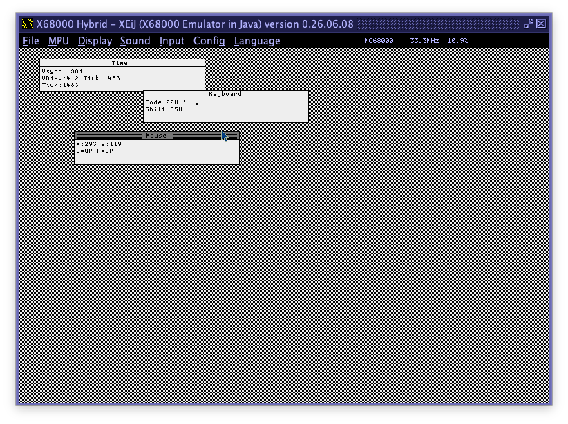

# SSOS for X68000

**SSOS** は X68000（MC68000 プロセッサ）向けの簡易オペレーティングシステムです。協調的マルチタスクとプリエンプティブマルチタスクの両方に対応し、グラフィックス管理、マウス対応ウィンドウシステムを備えます。

## 前提条件

- <https://github.com/yunkya2/elf2x68k> からクロスコンパイルツールセットをセットアップ・ビルドする
- macOS 15 Sequoia で `make all` する前に、以下の変更を加えて elf2x68k をコンパイルする

```sh
brew install texinfo gmp mpfr libmpc
```

- `scripts/binutils.sh` に Homebrew のライブラリパスを追記:

```bash
--with-gmp=/opt/homebrew/Cellar/gmp/6.3.0 \
--with-mpfr=/opt/homebrew/Cellar/mpfr/4.2.1 \
--with-mpc=/opt/homebrew/Cellar/libmpc/1.3.1
```

- 詳細なセットアップ手順は <https://github.com/sokoide/x68k-cross-compile> を参照

## ビルド

### 環境設定

```bash
export XELF_BASE=/path/to/your/cloned/elf2x68k/m68k-xelf
export PATH=$XELF_BASE/bin:$PATH

# 環境ファイルを読み込む（推奨）
. ~/.elf2x68k
```

### スタンドアローン開発ビルド（テスト推奨）

高速な開発イテレーションのため、Human68K 実行形式としてビルド:

```bash
cd ssos-cooperative    # または ssos-preemptive
make clean             # ターゲット切り替え時に必須
make standalone
# 出力: ~/tmp/ssos_cop.x または ~/tmp/ssos_prm.x
```

### OS ビルド（起動可能ディスク）

```bash
cd ssos-cooperative    # または ssos-preemptive
make clean             # ターゲット切り替え時に必須
make
# 出力: ~/tmp/ssos.xdf（起動可能ディスクイメージ）
```

生成された XDF ファイルを X68000 エミュレータで起動:



### その他のビルドコマンド

```bash
make compiledb      # LSP 対応の compile_commands.json を生成
make dump           # バイナリの逆アセンブル出力（デバッグ用）
make readelf        # ELF ファイル情報を表示
make clean          # ビルド成果物を全て削除
```

## アーキテクチャ概要

### プロジェクト構成

```
ssos-68k/
├── ssos-cooperative/          # 協調的マルチタスク版
│   ├── boot/                  # アセンブリ製ブートセクタ
│   ├── os/
│   │   ├── kernel/            # コア OS: interrupts.s, scheduler.c, kernel.c, task_manager.c
│   │   ├── app/               # アプリケーション: 3 ウィンドウ（Timer/Keyboard/Mouse）、ドラッグ、 marching-ants 枠線
│   │   ├── gfx/               # グラフィックスプリミティブ
│   │   ├── mem/               # メモリ管理
│   │   ├── ipc/               # プロセス間メッセージング
│   │   └── win/               # 汎用ウィンドウシステム (SS_MAX_WINDOWS=32): z-order, hit-test, region render
│   └── standalone/            # スタンドアローンビルド（Human68K .x 実行形式、独自 main.c）
├── ssos-preemptive/           # プリエンプティブマルチタスク版
│   └── （同構造）
├── ssos/                      # 旧統合ビルド（非推奨）
└── docs/                      # ドキュメント
```

### 主要コンポーネント

| コンポーネント | 説明 |
|-----------|-------------|
| **interrupts.s** | MFP 初期化、Timer D（200Hz ティック）ISR、V-DISP（60Hz vsync）ISR |
| **scheduler.c** | 協調的: 明示的 yield / プリエンプティブ: タイマベースのコンテキストスイッチ |
| **task_manager.c** | タスク生成、状態管理、sleep/wakeup |
| **kernel.c** | カーネルメインループ、V-sync 処理、キー入力管理 |
| **memory.c** | 4KB ページアライメントのカスタムアロケータ |
| **win/window.c** | ウィンドウ z-order、hit-test、render_all、render_region、dirty region。`SS_MAX_WINDOWS=32`。 |
| **app/main.c** | デモ: 3 ウィンドウ（Timer/Keyboard/Mouse）+ ドラッグ + marching-ants 枠線 + コンテンツ差分更新 |

### 2つのマルチタスクモデル

- **協調的** (`ssos-cooperative/`): タスクは `ss_task_yield()` で明示的に CPU を譲る。ISR はカウンタのインクリメントとフラグ設定のみ行い、起床処理は全てメインループで実行。
- **プリエンプティブ** (`ssos-preemptive/`): Timer D ISR がコンテキストスイッチを実行。各スイッチ時に全レジスタを保存/復元。

### スタンドアローン vs OS モード

- **スタンドアロンモード** (`.x`): `LOCAL_MODE` 定義ありで Human68K 実行形式としてコンパイル。gfx/mem/kernel コードを共有するが、独自の `main.c` と独自のウィンドウ/フレーム/ドラッグ実装を持つ。開発イテレーションが高速。
- **OS モード** (`.xdf`): カスタムブートローダを持つ完全起動可能システム。スタンドアロンモードから切り替える際は `make clean` が必要。

#### ウィンドウ Z-Order 管理: OS モードがスタンドアローンと異なる理由

| 観点 | `.x`（スタンドアローン） | `.xdf`（OS） |
|--------|-------------------|-------------|
| Z-order 保存 | `int zmap[NUM_WINS] = {0,1,2}`（順序配列） | `SSWindow` の `uint16_t z` フィールド |
| アクティブ判定ルール | `i == NUM_WINS-1`（zmap の最後） | `self->z == ss_win_active_z`（最大 z） |
| ドラッグ操作 | `bring_to_front(idx)`（最後尾スロットへ移動） | `ss_win_set_z(hid, next_z++)`（単調増加） |
| Z 衝突 | 不可能（配列順序、値の重複なし） | 可能性あり（next_z を初期 z 範囲より上にする必要あり） |

**OS 版がスタンドアローンの方式を流用しない理由:**

スタンドアローン版は 3 ウィンドウ固定で `zmap[]` を 3 要素の順序配列として使う — スロットインデックスがそのまま z 値となる。これは簡潔だがスケーラブルではない。

OS 版 (`os/win/window.c`) は `SS_MAX_WINDOWS=32` の汎用ウィンドウマネージャである。その設計は:

1. **ウィンドウごとに `z` を保存**: 各 `SSWindow` が自己記述的になる。外部の順序簿なしでウィンドウの作成/破棄/再作成が可能。
2. **`ss_win_render_all` / `ss_win_render_region` で z=0..255 をイテレート**: z-order で描画する汎用アルゴリズム。任意のウィンドウ数で動作。
3. **`rebuild_zmap` でブロックレベル max-z を使用**（8×8 ブロックのオクルージョンマップ）: 各ウィンドウが z 値を持つことで成立する設計。
4. **ドラッグによる前面移動で z を単調増加**: 順序配列のスキャンなしで、ドラッグされたウィンドウが確実に新たな最前面になる。

トレードオフとして、**単調増加 z は初期状態に注意が必要**: 最初のドラッグが起動時の z 値と衝突してはいけない。OS 版は `next_z` を初期 z の最大値より 1 大きい値（z=1..3 で作成したウィンドウに対して `next_z = 4`）に設定することで、2 つのウィンドウが同一 z 値（両方アクティブ表示になる）を共有するのを防いでいる。後述の「知見」s29 を参照。

## MFP 割り込み設定

### 現在の設定

| レジスタ | アドレス | 値 | 効果 |
|----------|---------|-------|--------|
| IERA | `$E88007` | `$FF` | 全ソース有効（IOCS 互換性） |
| IERB | `$E88009` | `$7F` | 全ソース有効（IOCS 互換性） |
| IMRA | `$E88013` | `$FF` | 全ソースマスク解除（Human68K 互換性） |
| IMRB | `$E88015` | `$7F` | 全ソースマスク解除、bit7 除く |
| VR | `$E88017` | `$41` | Auto-EOI、ベクタベース 0x40 |
| TACR | `$E88019` | `$08` | イベントカウントモード（Human68k 互換） |
| TCDCR | `$E8801D` | `$xx7` | Timer D プリスケーラ /200 |
| TDDR | `$E88025` | `100` | Timer D: 4MHz / 200 / 100 = 200Hz (5ms) |
| Vector 0x110 | — | `ss_timerd_handler` | Timer D ISR |
| Vector 0x134 | — | `ss_vdisp_handler` | V-DISP / Timer A ISR |

### 設計根拠

- **IER は `$FF/$7F` のまま**: IOCS 関数は対応する IER ビットがセットされている必要がある。IER を変更するとキーボード USART やタイマのボーレートジェネレータが動作しなくなる。
- **IMR は全マスク解除（`$FF/$7F`）**: Human68K のキーボード、マウス、CRTC の ISR は動作し続ける必要がある。当コードはベクタ 0x134（V-DISP）と 0x110（Timer D）のみ上書きし、その他のベクタはすべて Human68K のハンドラを指したまま。IMR ビットをマスクすると IOCS のキーボード/マウス入力が動作しなくなる。
- **`ss_set_interrupts()` は全 IOCS 初期化の後に呼び出すこと**（CRTMOD、MS_INIT 等）。IOCS 呼び出しが MFP を再プログラムするため。

### ISR 設計

Timer D と V-DISP の両 ISR は:
1. エントリで割り込み禁止 (`move.w #0x2700, %sr`)
2. 最小限のレジスタを保存 (`d0/a0`)
3. カウンタをインクリメントしフラグを設定（ISR 内で C 関数呼び出しなし）
4. ISR の in-service ビットをクリア
5. 割り込み再許可 (`move.w #0x2000, %sr`)
6. `rte`

## デバッグ

### MFP レジスタ追跡

両バージョンとも `mfp_debug.c` で IOCS 呼び出し前後の MFP レジスタ変更を追跡:

- `ss_dump_mfp_regs()`: 15 個の MFP レジスタをスナップショット
- `ss_diff_mfp_regs()`: 2 つのスナップショットを比較、差分を整形表示
- `ss_mfp_track_begin()` / `ss_mfp_track_end()`: IOCS 呼び出しのラッパー、変更をテキスト VRAM に記録
- キーボードウィンドウの line[2] に Timer D 関連レジスタ（IMRA, IMRB, ISRB, TCDCR, TDDR）をリアルタイム表示

### 例外ハンドラ

TRAP #14 ハンドラが不正命令を捕捉し、PC、SR、問題のオペコードを画面表示 — 割り込みネストによるスタック破壊の検出に有用。

## 知見

### Timer D ISR 分析（Session 21）

**所見**: Timer D ISR の実装は正しく、フリーズの原因ではない。

| 指標 | 値 |
|--------|-------|
| 命令数 | 11 |
| サイクル数 | 90（10MHz: 9.0μs、16MHz: 5.6μs）|
| スタック使用量 | 14 バイト（8 レジスタ + 6 例外フレーム）|
| ネスト防止 | ✅ エントリで `move.w #0x2700, %sr` |
| V-DISP への干渉 | ✅ 最大 9.2μs の遅延（5ms 周期の 0.18%）|

### MFP 初期化コード検証（Session 21）

**所見**: `ss_set_interrupts()` で設定する MFP レジスタ値は正しい。スタンドアローンモードの初期化順序も正しい — `ss_set_interrupts()` は全ての IOCS 呼び出しの後に呼ばれている。

**ただし**: 実行時の IOCS 呼び出し（`_iocs_b_keyinp()`、`_iocs_ms_getdt()`、`_iocs_ms_curgt()`）が MFP レジスタを再プログラムする可能性があり、Timer D が約 82 ティック後に停止することがある。

### 協調的 ssos_cop.x フリーズ問題（解決済み）

**症状**: タイマが約 82–109 ティックで停止、キーボード/マウス応答なし、約 20–30 秒後に画面破損。

**根本原因（2 つのバグ）**:

1. **`ss_task_yield` のレジスタ保存不足**: 協調的 yield は `d0/a0`（2 レジスタ）しか保存せず、`d0-d7/a0-a6`（16 レジスタ）を保存する必要があった。コンテキストスイッチ時に、もう一方のタスクによって callee-saved レジスタ（`d2-d7/a2-a6`）が破壊され、C コンパイラのレジスタ仮定が破綻 → ポインタ破損 → フリーズ、最終的に VRAM 破損。

2. **IMR の過剰マスク**: `IMRA=$21, IMRB=$10` は Timer A と Timer D 以外の全割り込みをマスクしていた。Human68K のキーボード/マウス ISR がブロックされ、IOCS 関数（`_iocs_b_keysns()`、`_iocs_ms_getdt()`）がデータを返さなくなった。

**修正**:
- `ss_task_yield`、yield-resume、`resume_interrupted` の各パスで全レジスタ保存/復元（`d0-d7/a0-a6`）に修正
- `IMRA=$FF, IMRB=$7F`（全マスク解除）に戻し、Human68K ISR が動作するよう修正

### `.xdf` アクティブタイトル表示修正（s27–s29）

OS モードのウィンドウタイトルレンダリングは、スタンドアローンと同等の表示になるまで 3 回のイテレーションを経た。

#### s27: 3 ウィンドウのコンテンツ + アクティブ用ハッシュストライプ（解決済み）

- **目標**: OS モードでスタンドアローンと同じ 3 ウィンドウデモ（`Timer` / `Keyboard` / `Mouse`）と、同じグレー+ハッシュストライプのアクティブタイトルを表示する。
- **変更箇所** (`os/app/main.c`, `os/win/window.c`, `os/win/win.h`):
  - ウィンドウごとに `WinContent`（タイトル + 3 行 + 前回値）、`render_win` コールバック
  - `ss_win_active_z`（表示中の最大 z、`ss_win_render_all` / `ss_win_render_region` で設定）によるアクティブ検出
  - 差分コンテンツ更新（`memcmp` で行ごとに前回値と比較）— 全画面再描画なし
  - Marching-ants ドラッグ枠線（`draw_march_outline`、frame & 7）と、その下地の `ol_save`/`ol_restore`
  - 領域限定レンダリング（`ss_win_render_region`）— ドロップ時は影響領域のみ再描画、全画面ではない
- **スタンドアローン影響なし**: `standalone/main.c` は `os/app/main.c` や `os/win/window.c` をリンクしない。

#### s28: ドラッグによる非アクティブウィンドウのタイトル固着（解決済み）

- **症状**: あるウィンドウを前面にドラッグした後、別のドラッグで別のウィンドウが新たな最前面になっても、*ドラッグされなかった*他のウィンドウが古いアクティブタイトル（グレー+ハッシュストライプ）のままになる。
- **根本原因**: `ss_win_render_region` はドロップされた矩形と重なるウィンドウのみ再描画する。`set_z` が `ss_win_active_z` を上げるとき、アクティブを*失った*ウィンドウは再描画領域の外にあるため、古い `is_fg=true` のピクセルが残る。
- **修正**: ドラッグ開始時に、新しい `ss_win_get_z` ゲッター（win.h / window.c）で従前のアクティブウィンドウの `(x, y, w, h)` を取得。ドラッグ終了時に `ss_win_render_region(new_pos)` の後、`ss_win_render_region(prev_active_pos)` を呼び出してアクティブを失ったウィンドウを再描画。
- **ファイル**: `os/app/main.c`、`os/win/win.h`、`os/win/window.c`。スタンドアローン影響なし。

#### s29: 初回ドラッグの z 衝突（解決済み）

- **症状**: 間欠的に、ドラッグ後に起動時にアクティブだったウィンドウがアクティブ表示のまま残る。
- **根本原因**: `next_z` が `3` から始まっていたが、これは既存の最前面ウィンドウ（z=3 で作成された `W3`）と同じ値だった。`ss_win_set_z(hid, 3)` により、ドラッグされたウィンドウが `W3` と z=3 を共有することになった。`ss_win_active_z` は `z==3` に一致するため、`is_fg = (z == ss_win_active_z)` が**両方に true** となる — 両方がアクティブ（グレー+ハッシュ）として描画される。
- **「間欠的」である理由**: 衝突するのは*最初の*ドラッグのみ（next_z が 3 → 4 に変わった後）。以降のドラッグは z=4, 5, … を生成し、固定の起動時 z=1..3 と衝突しない。
- **スタンドアローンにこのバグがない理由**: 3 スロットの順序配列 `zmap[3]={0,1,2}` と `bring_to_front(idx)` を使っている — 配列スロットは衝突しない。
- **修正**: `next_z` を `4` に初期化（初期 z の最大値より 1 大きい値）。最初のドラッグ → hid z=4、z=3 の起動時ウィンドウと衝突しない。

### MFP IMR 設定の変遷

| Session | 変更 | 影響 |
|---------|--------|--------|
| Pre-s12 | IMR=$FF/$7F | 全マスク → Timer D が発火せず → データスレッド停止 |
| s12 | IMR=IERA=$38/$3C | 未ハンドルのソースがマスク解除 → クラッシュ |
| s14 | IMR=IERA=$30/$10 | Timer B がマスク解除、ベクタ未初期化 → クラッシュ |
| s16 | IMR=$20/$10、IER=$FF/$7F | Timer A + D のみマスク解除。IER 維持。✅ |
| s20 | TACR 0xC8→0x08 | 誤った変更を差し戻し。イベントカウントモード。✅ |
| s20 | ISR: `move.w #0x2700, %sr` を追加 | 割り込みネスト防止 → スタック破損防止。✅ |
| s20 | `.resume_interrupted`: 三重 SR 復元を削除 | `rte` が SR を自動的にポップ。重複コード削除。✅ |
| s23 | `ss_task_yield`: `d0/a0` → `d0-d7/a0-a6` | 協調的 yield は全レジスタ保存必須（コンテキストスイッチで callee-saved が破壊される）。✅ |
| s23 | IMR `$21/$10` → `$FF/$7F` | Human68K ISR はキーボード/マウスのため全動作必須。✅ |

### 協調的 vs プリエンプティブ ISR の差異

| 観点 | 協調的 | プリエンプティブ |
|--------|-------------|------------|
| Timer D ISR | カウンタ++ + フラグ、コンテキストスイッチなし | カウンタ++ + コンテキストスイッチ |
| レジスタ保存 | `d0-d7/a0-a6`（yield で全保存） | `d0-d7/a0-a6`（完全スイッチ） |
| 起床 | メインループが `ss_wakeups_needed` フラグをポーリング | ISR が直接コンテキストスイッチをトリガ |
| スタック | 現在のタスクスタックのみ | 各タスクが専用スタックを持つ |

### ベアメタル (`.xdf`) マウス／ウィンドウ入力 — 解決済み (s26)

**影響ビルド**: ベアメタルブート（`ssos_cop.xdf`、IPL-ROM ブート）。standalone（`.x`）は**影響なし**。

**症状**: 背景＋空ウィンドウ2つが表示され、マウス・キーボードに反応しない（ように見えた）。

#### 根本原因

**マウス入力チェーンは最初から動作していた。問題は「カーソルが見えない」こと。**

`premain.c` がビデオコントローラ `0xE82600=$003E` で**テキストレイヤー(bit0)をOFF**にしている。IPL-ROM のマウスカーソルはテキスト画面プレーン2/3に描かれるため、テキストOFF下では不可視。`_MS_CURGT` の座標は内部的に更新されているが、画面に描画されないため「入力不能」に見えた。

#### s26 計測で判明した事実（実機確認）

| 計測値 | 値 | 意味 |
|--------|-----|------|
| `V0`=`V2` | `$3F003039` | SCC ベクタ 0x140/0x148 は **RAM上の有効ハンドラ**を指す（0/FFFFFFFF ではない → ハンドラ登録済み） |
| `SR` | `$2004` | Supervisor + **IPL0**（割込全許可）+ Z旗標。割込マスクなし |
| `MX` | 同一起動中に変化 | `_MS_GETDT` がマウス移動量を取得（s24では常に0） |
| `CG` | `(188,254)→(476,360)` 等に変化 | `_MS_CURGT` 絶対座標が更新されている |
| `VS/VD/TD/LB` | 増加中 | Timer D/V-DISP 発火、メインループ正常回転 |

SCC受信 → 割込(0x148) → IPL-ROMハンドラ($3F003039) → 座標更新 → `_MS_CURGT`/`_MS_GETDT` 返値更新、の全チェーンが機能。s25 の `boot.s`/`premain.c` で `_MS_INIT`/`_MS_CURON` を呼んだことで SCC 受信が有効化されていた。

#### 修正（`ssos-cooperative/os/app/main.c`、`os/win/window.c`）

1. **マウス座標**: `_MS_GETDT`Δ累積 → `_MS_CURGT`絶対座標（standalone互換、同一ソース）
2. **ソフトウェアカーソル**: GVRAM に XOR 枠線描画（テキストレイヤー非依存）。XOR は自分自身で相殺するため保存バッファ不要
3. **ドラッグ枠線方式**: ドラッグ中は XOR 枠線のみ（ウィンドウ本体不動）、ドロップ時のみ `ss_win_render_all()`。ちらつかない（standalone 準拠）
4. **z 一意化**: `next_z=3` 開始、255→3 折り返し。複数ウィンドウが同 z=255 にならない（w1消失バグ解消）
5. **`rebuild_zmap` 修正**: max z 化 + `memset(zmap,0)`（旧 `0xFF` 初期値だと max 更新 `win->z>255` が常に false → 全ウィンドウ occluded → 非表示）

#### standalone 無影響の根拠

standalone ビルドは `obj/interrupts.o main.o scheduler.o buddy.o slab.o vram.o` のみリンク（`window.o` なし）。`standalone/main.c` は `win.h` 未参照・独自 `Win`/`draw_frame`/`ol_save`/`draw_march_outline` 実装を持つ。よって `window.c`/`win.h`/`app/main.c` の変更は standalone に無影響。

### IOCS マウスルーチン番号（参考）

| 番号 | ルーチン | 機能 |
|--------|---------|----------|
| `$70` | `_MS_INIT` | マウス初期化 |
| `$71` | `_MS_CURON` | カーソル表示 |
| `$72` | `_MS_CUROF` | カーソル非表示 |
| `$73` | `_MS_STAT` | カーソル表示状態（-1=表示中、0=非表示）|
| `$74` | `_MS_GETDT` | 移動量: bit24-31=Δx, bit16-23=Δy, bit8-15=左, bit0-7=右 |
| `$75` | `_MS_CURGT` | 位置（X<<16 \| Y）|
| `$76` | `_MS_CURST` | 位置設定 |
| `$77` | `_MS_LIMIT` | 制限設定 |
